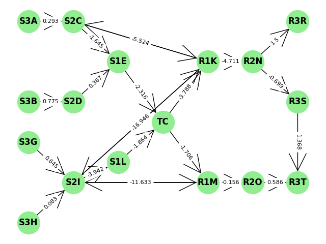
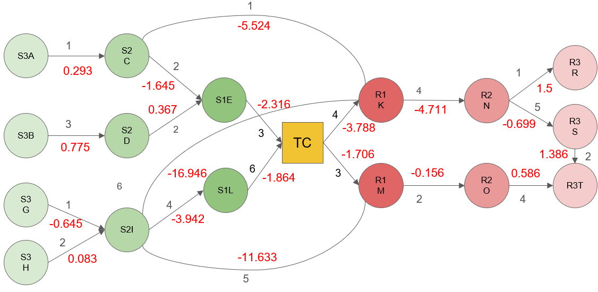

# How this was run

The Jupyter Notebook is run in Python 3.11.0

# Image of the Forman Ricci curvature values in graph

Figure 1 is the graph of the Forman Ricci Curvatures in the graph generated by the Python code. However, to improve readability, Figure 2 is included with the Forman Ricci Curvatures (in red) and the weights of those edges (in black)

_Figure 1: Forman Ricci Curvature values_

_Figure 2: Forman Ricci Curvature values with weights_

# Forman Ricci curvature value calculation explained

For weighted directed graphs such as the graph in the image, the formula used to compute the Forman Ricci Curvature values were from the paper: [Discrete Ricci curvatures for directed networks](https://doi.org/10.1016/j.chaos.2018.11.031). For bidirectional edges, the following formula was used:

$F(e) = w_e\left(\frac{w_{v_1}}{w_e}-\left(\sum_{e_{v_1}\sim e}\frac{w_{v_1}}{\sqrt{w_ew_{e_{v_1}}}}\right)\right) + w_e\left(\frac{w_{v_2}}{w_e}-\left(\sum_{e_{v_2}\sim e}\frac{w_{v_2}}{\sqrt{w_ew_{e_{v_2}}}}\right)\right)$

For the directed edges, the formula was as follows:

$F(e) = w_e\left(\frac{w_{v_1}}{w_e}-\left(\sum_{e_{I,v_1}\sim e}\frac{w_{v_1}}{\sqrt{w_ew_{e_{I,v_1}}}}\right)\right) + w_e\left(\frac{w_{v_2}}{w_e}-\left(\sum_{e_{O,v_2}\sim e}\frac{w_{v_2}}{\sqrt{w_ew_{e_{O,v_2}}}}\right)\right)$
